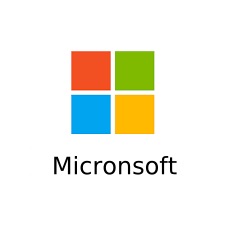

<p align="center">
  
</p>


## Innholdsfortegnelse

- [Introduksjon](#introduksjon)
- [Gruppe Medlemmer](#gruppe-medlemmer)
- [Domene Model](#domene-model)
- [Problemer](#problemer)
- [Organisasjonskart](#organisasjons-kart)


## Introduksjon

Målet med oppgaven var å sette opp en Active Directory for en bedrift. Selskapet vi skal sette op AD for er `Micronsoft` som er et ny oppstartet IT/ konsulent firma. De har avdelinger innenfor IT, konsultasjon, administrasjon og HR. 

## Gruppe-Medlemmer

- Daniel Sarjomaa
- Harald Martin Raanes
- Eskil Lykke Refsgaard

## Domene-modell

**`Modellen for OU`**


```
micron.soft
└── AllUsers
    ├── Adm
    |── Cons
    │   ├── Prog
    │   └── Web
    └── HR
    └── IT
        └── ITAdmin
        └── Supp
```

## Organisasjons-kart


## Utfordringer

- *`PSSession`*  
    - PSSession brukes for å remote koble seg til andre enheter. Planen vår var å bruke dette for å joine de ulike enhetene sammen i Active Directory remotely. Problemet vi møtte på, var at vi først måtte enable remote connection via et script på hver enhet vi ønsket å koble sammen først.

    >> New-ItemProperty -Name LocalAccountTokenFilterPolicy `
    >> -Path HKLM:\SOFTWARE\Microsoft\Windows\CurrentVersion\Policies\System `
    >> -PropertyType DWord -Value 1
    >> Enable-PsRemoting -Force

    -  Dette gjorde at det ikke lenger var hensiktmessig å bruke denne metoden for raskest/mest effektivt oppsett for Active Directory. Dermed så valgte vi at det ikke var nødvendig å bruke PSSession for dette prosjektet
    - Et annet problem vi støtte på som var relatert til PSsession var å kunne utføre kommandoer i computeren som hosten var kobla til. I noen av tilfellene opplevde vi at noen av kommandoene ikke ble utført på den tilkoblede sin datamaskin, men heller ens egen. Vi har ikke funnet noen god løsning på dette og valgte derfor ikke å kjøre scripts remotely på andre enheter. 
- *`OUs`* 
    - Litt problemer med å få slette alle OUene. Fant til slutt komandoen på [Microsoft.docs](https://docs.microsoft.com/en-us/powershell/module/activedirectory/remove-adorganizationalunit?view=windowsserver2022-ps) for å slette OUer sammen med brukerne som befant seg i disse

- *`Installer av pwsh, git, sysinternals`*
    - Planen var å ha et script liggende i [Github.gist](https://gist.github.com/Datakriger101/2aeece14caa9bd022a1587b91b73bfa4) og kjøre dette fra vårt [menuscript.ps1](menuScript.ps1)
    bruke dette aktivt for å laste ned de ulike applikasjonen/ programmene samt repoet som er nødvendige for å sette opp Active Directory for *Micronsoft*. Første problem ble at når et repo skal clones ned på dc1 via scriptet, blir man spurt om en "access token". Vi bestemte oss derfor å clone repoet manuelt.
    - Et annet problem vi hadde med dette var aliaset [iex](https://docs.microsoft.com/en-us/powershell/module/microsoft.powershell.utility/invoke-expression?view=powershell-7.2), eller InvokeExpression kommandoen. Dette fikk vi problemer med i script analyzer. 
    - Vi løste begge problemene ved å heller laste ned repoet som en zip fil og starte *menuScriptet.ps1* hvor alle scriptene kjøres fra. Da er det ikke bruk for access token og InvokeExpression blir heller ikke noe problem gjennom Pipelinen. 

- *`Script Analyzer`*
    - Vi har hatt litt problemer med å forstå flere av error meldingene som har oppstått når vi har pushet kode. Vi kunne se i pipelinen som ble kjørt at det var en god del unødvendige whitespaces som vi fjernet relativt fort.
    - **PSUseBOMForUnicodeEncodedFile** var et annet script analyzer problem vi fikk. Dette er et problem som omhandler hvordan [Powershell bruker kryptering av tegn](https://docs.microsoft.com/en-us/powershell/module/microsoft.powershell.core/about/about_character_encoding?view=powershell-7.2) for input og output av string data. Problemet ble løst når vi endret "encodingen" fra *UTF-8* til *UTF-8 with BOM*. Problemet kunne også løses ved å fjerne alle ÆØÅ tegn siden disse bokstavene var årsaken til problemet. Da endret vi mye av kommenteringa i koden vår til å heller bruke "o for ø", "a for å" og "ae for æ"

    - I menu scriptet vårt hadde vi en **InvokeExpression** kommando som Script Analyzer ikke ville godta. Vi brukte kommandoen for å laste ned noen applikasjoner fra [Github.gist](https://gist.github.com/Datakriger101/2aeece14caa9bd022a1587b91b73bfa4). Disse vil dermed bare bli lagt til når koden kjøres. Det var dette vi ønsket å laste ned via **InvokeExpression** kommandoen. Løsningen ble bare å kjøre den manuelt.
    - PSAvoidUsingConvertToSecureStringWithPlainText er en error som vi bare eksluderer i pipelinen. Finnes under [Editor](https://gitlab.stud.idi.ntnu.no/daniepsa/dcsg-1005-prosjekt/-/ci/editor?branch_name=main) i Pipeline fanen.

- *`GPO`* 
    - GPO var noe gruppen var litt usikker på når vi startet på prosjektet, så vi bestemte oss for å finne en god løsning når vi hadde fått det andre grunnleggende på plass. Da vi først startet hadde vi planlagt å bare laste ned noen (grunnleggende/ standard) GPOer og editere de slik at de passer våre OUer. Dette fungerte ikke. Løsnigen ble her å manuelt lage egene GPOer som skulle lastes ned for domenet.
    - Microsoft sin Security Baseline var en løsning vi vurderte. Problemet var at vi her ikke hadde muligheten til å endre GPOene slik vi ville, spcripps som fulgte med i baseline toolkitet ble brukt, ettersom disse hjalp mye med å få importert en stor mengde GPOer fra en backup. Vi fikk hjelp av faren til Harald Martin med å få en bedre forståelse for hvordan oppsettet med GPOer fungerer, ettersom at han erfaring innenfor dette temaet 
    - Til slutt ble det laget omtrent 20 ulike gpoer som endret en policy per object. F.eks vil Adm. Bakgrunnen bare sette bakgrunnen for administrasjons brukere, ikke noe mer. Alle disse ble det gjort en backup av og lastet opp i git repoet slik at man kunne enkelt hente de ved hjelp av GPO scripts.
    - Et siste problem her var at det var problematisk å sjekke om ulike GPOer overskrev hverandre, feks hadde vi flere GPOer som var satt til alle brukerene som feks hindret brukeren i å bruke kontrollpanelet. Dette ville vært upopulært for IT brukere, så vi har en IT GPO som skrur av denne funksjonen. Om IT brukerene fikk all users GPOen eller ikke var vanskelig å se. Men ved å flytte brukere litt rundt så var det mulig å logge inn på feks admin brukeren på CL1 etter å ha flyttet brukeren til IT gruppen, og sjekke om den hadde tilgang til kontroll panelet.

- *`UPN - The operation failed because UPN value provided for addition/modification is not unique forest-wide.`*
    - [UPN](https://www.codetwo.com/kb/upn/) står for "User Principal Name" og er error meldingen vi fikk angående denne variabelen var i forhold til [CreateUsers.ps1](https://gitlab.stud.idi.ntnu.no/daniepsa/dcsg-1005-prosjekt/-/blob/main/code/CreateUsers.ps1)
    - Løsningen vi kom med var å legge hver mail på formatet "FornvavnEtternavn(et tall)@micron.soft". Tallet på slutten er med for å gjøre det mulig å skille den fra hverandre. Scriptet vi har gjør det mulig å opprette så mange brukere vi ønsker og legge dem inn for det allerede eksiterende OUene. Vi bestemmer også antall for hvor mange som skal inn i hver OU. 


## Copyright

[Micronsoft.com](https://www.microsoft.com/nb-no/) :)
